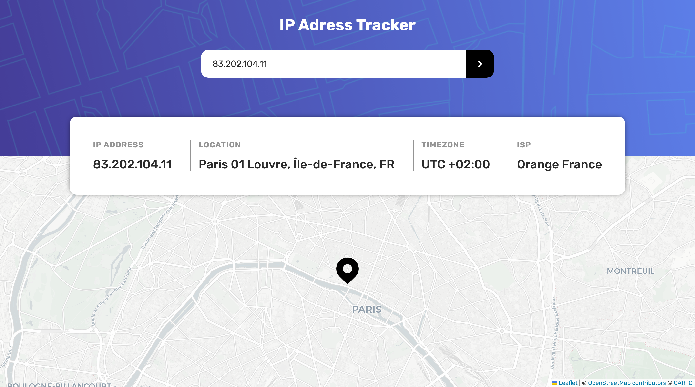

# Frontend Mentor - IP address tracker solution

This is a solution to the [IP address tracker challenge on Frontend Mentor](https://www.frontendmentor.io/challenges/ip-address-tracker-I8-0yYAH0). Frontend Mentor challenges help you improve your coding skills by building realistic projects. 

## Table of contents

- [Overview](#overview)
  - [The challenge](#the-challenge)
  - [Screenshot](#screenshot)
  - [Links](#links)
- [My process](#my-process)
  - [Built with](#built-with)
  - [What I learned](#what-i-learned)

## Overview

### The challenge

Users should be able to:

- View the optimal layout for each page depending on their device's screen size
- See hover states for all interactive elements on the page
- See their own IP address on the map on the initial page load
- Search for any IP addresses or domains and see the key information and location

### Screenshot

### Links

- Solution URL: [https://github.com/telemoca/ip-tracker](https://github.com/telemoca/ip-tracker)
- Live Site URL: [https://ip-tracker-chi-lovat.vercel.app/](https://ip-tracker-chi-lovat.vercel.app/)

## My process

I built first the API part, then the Vue structure, then the styling, and then media queries for mobile.

### Built with

- Semantic HTML5 markup
- CSS custom properties
- Flexbox
- Media queries
- [Vue.js](https://vuejs.org/) - JS library

### What I learned

I learned how to use APIs with fetch, and how to make a map in JS